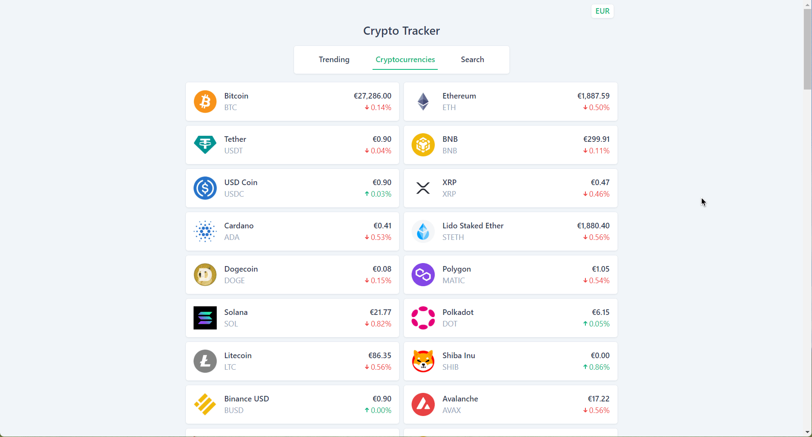

## CRYPTO-HAWKSHAW
CRYPTOCURRENCY TRACKER FOR REAL-TIME MARKET ANALYSIS AND MONITORING
The application features a comprehensive main tab that displays the top 100 crypto coins with their current prices in EUR and USD, a trending coins tab for staying updated with the latest market trends, and a search functionality for finding specific cryptocurrencies. Moreover, this web app offers an interactive model that shows a detailed price chart using Chart.js, showcasing the price trends for the last seven days and other key information about the selected coin.
## Features

Top 100 Cryptocurrencies:** The main tab displays the top 100 cryptocurrencies and their current prices, providing users with an overview of the cryptocurrency market.

- **Trending Coins:** The application also has a tab that displays the trending coins, helping users to stay updated with the latest trends in the cryptocurrency market.

Detailed Modal: Users can click on the coin logo to open a modal that displays a graph showing the selected coin's price trend over the past seven days. The modal also displays other relevant information about the coin, such as its name, symbol, market cap, and more.

- **Currency Conversion:** The application allows users to change the displayed currency between EUR and USD, allowing users to view prices in their preferred currency.

- **Search Functionality:** The application provides functionality that allows users to search for specific cryptocurrencies, making it easy to find and track their favorite coins.

## Technologies

- React, Typescript, Tailwind CSS, React Query.

- Chart.js: A powerful charting library for creating interactive and responsive charts.

- CoinGecko API: A free and reliable API for fetching cryptocurrency data, including prices and other relevant information.

## Demo

You can see a live demo of the CryptoHawkshaw application [right here](https://tomkiboi.github.io/CRYPTO-HAWKSHAW/).

## Licence

This is an open-source project and is available under the [**MIT License**](LICENSE). You are free to use, modify, and distribute the code under the terms of the license.

## Contributors

Contributions are highly appreciated! If you encounter any issues or have suggestions for improvements, please feel free to open an issue or submit a pull request.

[TOMKIBOI](https://tomkiboi.github.io/CRYPTO-HAWKSHAW/)
